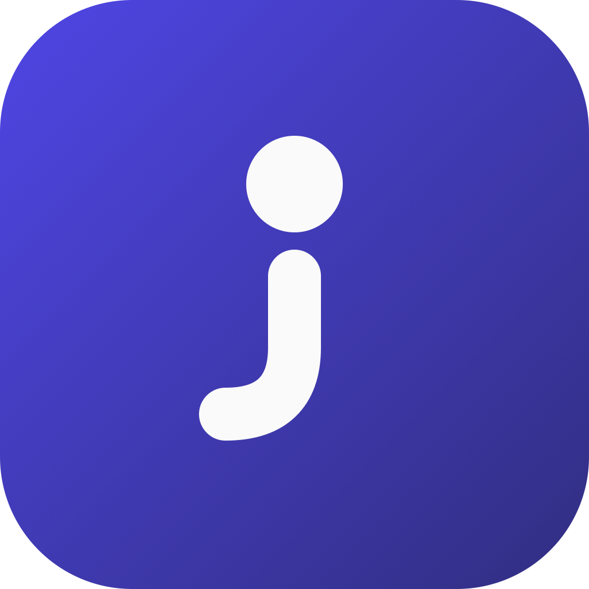

# DayJot

Plain-file notes for Mac and iPhone: daily notes, wiki links, fast local
search, and private git sync over your own Markdown. No accounts, no AI.

[](https://github.com/walkjoi/dayjot/releases/latest)
[](https://github.com/walkjoi/dayjot/actions/workflows/ci.yml)
[](LICENSE)

DayJot is an open-source note-taking app built around a folder of Markdown
files. It opens to today's note, lets `[[wiki links]]` connect people,
projects, and ideas, and keeps search and backlinks fast without turning your
notes into an app-only database.

The app does not require a DayJot account, and it contains no AI: no chat,
no model providers, no API keys. Notes live in a folder you choose, and the
only optional services — iCloud, GitHub, or another git remote — are
connected directly by you.

DayJot is an independent fork of
[Reflect](https://github.com/team-reflect/reflect-open) (MIT), renamed and
maintained separately. Importing a Reflect V1 export is still supported.

## Features

- **Daily notes:** the app opens to today's note, and capture defaults there.
- **Timestamps:** `⌘⇧T` drops a `- HH:mm` line at the cursor — interstitial
  journaling, one keystroke.
- **Wiki links and backlinks:** type `[[` to link notes; each note shows what
  links back to it.
- **Local search:** `⌘K` searches notes, backlinks, and tags — fast, lexical,
  entirely on this device.
- **Private notes:** `private: true` excludes a note's content from every
  external service (publishing included).
- **Browser capture:** save links, selected text, screenshots, and page text
  from Chrome.
- **Sync choices:** connect GitHub (or any git remote) for versioned, synced
  backup — or use iCloud Drive for zero-config Apple file sync.
- **CLI:** `dayjot today`, `dayjot search`, and `dayjot show` are available
  for scripts and agents. See [docs/cli.md](docs/cli.md).

## Install

1. **Install the Mac app.** Download the latest release for your Mac:
   - **Stable:** [Apple silicon (M-series)](https://github.com/walkjoi/dayjot/releases/latest/download/DayJot_aarch64.dmg) · [Intel](https://github.com/walkjoi/dayjot/releases/latest/download/DayJot_x86_64.dmg)
   - **Beta:** [Apple silicon (M-series)](https://github.com/walkjoi/dayjot/releases/download/updater-beta/DayJot.Beta_aarch64.dmg) · [Intel](https://github.com/walkjoi/dayjot/releases/download/updater-beta/DayJot.Beta_x86_64.dmg)

   Releases produced by this repo's pipeline are signed, notarized, and
   auto-updated from GitHub Releases (this requires your own Apple Developer
   credentials — see [docs/macos-distribution.md](docs/macos-distribution.md)).
   You can also [view all releases](https://github.com/walkjoi/dayjot/releases).
2. **Install the iOS beta.** The iOS app uses the same plain-file graph and
   sync options as the Mac app. Distributing it through TestFlight requires
   your own App Store Connect setup — see
   [docs/ios-testflight.md](docs/ios-testflight.md).
3. **Install the Chrome extension.** Build and load
   [the capture extension](apps/extension/README.md) from source to save the
   current page, selected text, screenshots, and optional page text from
   Chrome. (The Chrome Web Store carries the upstream Reflect Capture listing,
   which targets the Reflect app, not DayJot.)

You can also [build from source](#building-from-source).

See [CHANGELOG.md](CHANGELOG.md) for release notes.

## Your Notes Are Files

DayJot calls a notes folder a **graph**. A graph is a folder you can inspect,
back up, sync, or edit with other tools:

```text
my-graph/
├── daily/2026-06-12.md     # Daily notes, named by date
├── notes/some-title.md     # Other notes, named from their titles
└── assets/                 # Images and attachments
```

Markdown files are the source of truth. DayJot adds search, backlinks, and
tags on top, but the files remain usable in any Markdown editor.

## Sync and Privacy

The default sync path is GitHub: connect a private repository in the app (or
add [any SSH git remote](docs/generic-git-remotes.md)) and your Markdown graph
is versioned, backed up, and synced to your other devices through a repo you
control.

For zero-config file sync across Apple devices, you can instead create your
graph inside an iCloud-synced folder such as `iCloud Drive/DayJotGraph`.
(A graph syncs through git or iCloud, not both.)

Note content stays on the device. External calls only happen after you
connect a git remote or use a platform sync service — there are no AI
providers and no telemetry on your notes. See [docs/privacy.md](docs/privacy.md)
for the full privacy model.

## Building from Source

Prerequisites:

- A recent stable [Rust toolchain](https://rustup.rs)
- Node.js with [pnpm](https://pnpm.io) 10
- Xcode Command Line Tools

```bash
git clone https://github.com/walkjoi/dayjot.git
cd dayjot
corepack enable
pnpm install
pnpm tauri dev
pnpm tauri build
```

## Project Layout

DayJot is a pnpm/Turborepo monorepo:

```text
dayjot/
├── apps/desktop/          # Mac and iOS app
├── apps/cli/              # `dayjot` CLI
├── apps/extension/        # Chrome capture extension
├── apps/native-host/      # Browser capture helper
├── packages/core/         # Shared TypeScript logic
├── packages/db/           # Database types and helpers
├── crates/index-schema/   # Shared index schema
├── design-system/         # Tokens and UI primitives
└── docs/                  # Product, architecture, and contributor docs
```

See [CONTRIBUTING.md](CONTRIBUTING.md), [docs/contributing/](docs/contributing/),
and [AGENTS.md](AGENTS.md) for conventions and development guides.

## Development

Common commands from the repository root:

```bash
pnpm dev              # Vite only, http://localhost:1420
pnpm typecheck        # TypeScript
pnpm lint             # oxlint
pnpm test             # vitest; use --run path/to/test for one file
pnpm check            # typecheck + lint

# Rust tests that compile the desktop crate need sidecars staged first
pnpm --filter @dayjot/desktop sidecar
cargo test --workspace
```

For iOS simulator development:

```bash
pnpm tauri:ios:dev "iPhone 17 Pro"
```

For TestFlight builds:

```bash
pnpm release:ios preflight --build-number=123
pnpm release:ios testflight --build-number=123 --wait
```

## Status

DayJot is in beta and used daily. The current focus is the Mac app, iOS
companion, browser capture, local-first data model, and sync reliability.

Windows, Android, and a plugin API are out of scope for now. See the
[V2 product vision](docs/dayjot-v2-product-vision.md) and the implementation
plans in [docs/plans/](docs/plans/) for the longer-term direction.

## License

[MIT](LICENSE).
